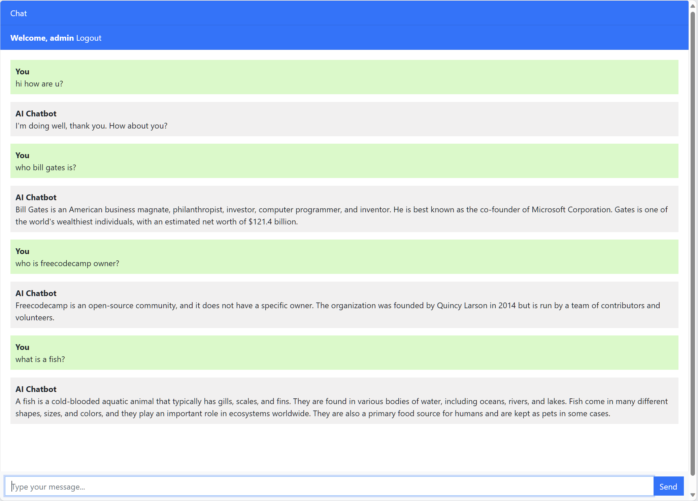

# freeCodeCamp - Django ChatGPT Clone
## Django
[Python](https://www.python.org/) [Django](https://www.djangoproject.com/) is a high-level web framework that allows developers to build web applications rapidly and efficiently. It follows the [Model-View-Template (MVT)](https://www.onlinetutorialspoint.com/django/django-model-view-template-mvt-overview.html) architectural pattern. [Django](https://www.djangoproject.com/) provides a collection of tools and libraries that make it easier to handle various web development tasks, so developers can focus on writing their application's business logic.

### freeCodeCamp - Django ChatGPT Clone
freeCodeCamp released [Use Django to Code a ChatGPT Clone course](https://www.youtube.com/watch?v=qrZGfBBlXpk) on the freeCodeCamp.org [YouTube channel](https://www.youtube.com/@freecodecamp) by Tomi Tokko. This course focuses on using [Django](https://www.djangoproject.com/), a high-level [Python](https://www.python.org/) web framework, and the [OpenAI API](https://openai.com/) to create a clone of the popular AI chatbot, [ChatGPT](https://chat.openai.com/).

#### Demo


## Getting started
**Requirements:**
- [Python 3.10](https://www.python.org/downloads/)
- [pip 23.0](https://pip.pypa.io/en/stable/cli/pip_install/)

**Follow the steps below**
```bash
# Clone the project and access the folder
git clone https://github.com/wwwwelton/django-chatGPT-clone && \
cd django-chatGPT-clone

# Install dependencies
pip3 install django
pip3 install openai

# Run app
python3 manage.py runserver
# in the WebBrowser open the address http://127.0.0.1:8000/

# You can access messages stored in the local database at address http://127.0.0.1:8000/admin
# with "admin" login and password

# Well done!
```

## 📝 License

This project is licensed under the GNU General Public License v3.0 - see the [LICENSE](LICENSE) file for details.

---

Made by: Welton Leite 👋 [See my linkedin](https://www.linkedin.com/in/welton-leite-b3492985/)
